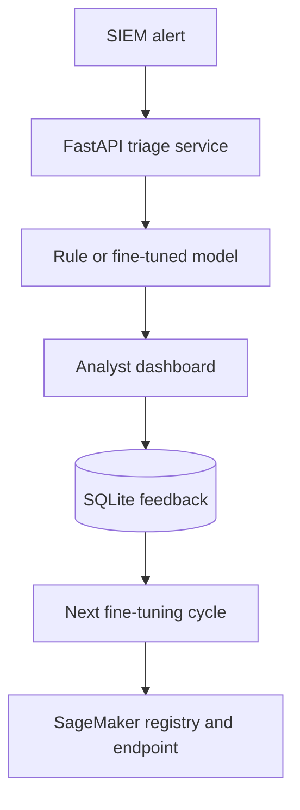

# Security Alert Triage Platform

A production-oriented portfolio project for security ML/AI roles. It demonstrates four separate, runnable capabilities: LLM fine-tuning with LoRA/QLoRA, AWS SageMaker training and deployment, a containerized inference API, and an analyst feedback dashboard.

## 한국어 단계별 실습

처음 실행하는 경우 [한국어 실습 시작 안내](docs/KO/00_START_HERE.md)를 먼저 읽으세요. 각 실습은 앞 단계의 결과를 사용하며, GPU나 AWS 계정이 없어도 0~4단계까지 완료할 수 있습니다.

| 단계 | 직접 해볼 일 | 예상 시간 | 비용 |
|---|---|---:|---:|
| 0 | 개발환경과 저장소 준비 | 20분 | 무료 |
| 1 | 보안 경보 데이터 생성·검사 | 25분 | 무료 |
| 2 | baseline 모델 학습·평가 | 35분 | 무료 |
| 3 | FastAPI 서비스 실행·테스트 | 30분 | 무료 |
| 4 | 분석가 피드백 대시보드 사용 | 30분 | 무료 |
| 5 | LoRA/QLoRA fine-tuning | 60~120분 | Colab 사용 시 변동 |
| 6 | Docker로 운영 형태 실행 | 30분 | 무료 |
| 7 | SageMaker 학습·배포·삭제 | 60분 | AWS 비용 발생 |

> Portfolio status: this is an engineering demonstration, not evidence of operation in a Toyota production environment. The included data are synthetic and must not be used to claim benchmark performance.

## Architecture



## 1. Run the local product

```bash
python -m venv .venv
source .venv/bin/activate  # Windows: .venv\Scripts\activate
pip install -r requirements.txt
make demo
make test
uvicorn triage.api:app --reload
```

In another terminal:

```bash
streamlit run dashboard/app.py
```

Open `http://localhost:8501`. The API docs are at `http://localhost:8000/docs`.

Example API call:

```bash
curl -X POST http://localhost:8000/v1/triage -H "Content-Type: application/json" -d '{
  "alert_id":"demo-001","title":"SSH anomaly",
  "description":"Repeated failures followed by a root login","source":"SIEM"}'
```

## 2. Fine-tune the LLM

The script uses supervised fine-tuning with PEFT. With `use_4bit: true`, it loads the base model in NF4 and trains LoRA adapters (QLoRA). A CUDA GPU with approximately 12 GB or more VRAM is recommended for the default model.

```bash
pip install -r requirements-llm.txt
python llm/fine_tune_lora.py --validate-only
python llm/fine_tune_lora.py --config configs/llm_config.json
```

Replace the six demonstration examples in `data/train.jsonl` with a properly licensed, de-identified train/validation/test dataset before evaluating the model. Never train on secrets or raw customer telemetry.

## 3. Use SageMaker

First configure AWS credentials, an execution role, and two S3 locations. Dry-run is safe and creates no cloud resources.

```bash
pip install -r requirements-aws.txt
python aws/launch_training.py --dry-run
export SM_TRAIN_DATA=s3://YOUR-BUCKET/security-triage/data
export SM_OUTPUT_PATH=s3://YOUR-BUCKET/security-triage/models
python aws/launch_training.py
python aws/deploy_endpoint.py --model-data s3://YOUR-BUCKET/path/model.tar.gz
```

Endpoints incur charges. Delete the endpoint when finished:

```bash
python aws/deploy_endpoint.py --model-data s3://unused --endpoint-name security-alert-triage --delete
```

## 4. Production deployment

```bash
docker compose up --build
```

The API includes health checks, typed validation, versioned routes, model version reporting, persistent feedback, Docker isolation, and automated CI. Before real deployment, add authentication, TLS, secrets management, rate limits, centralized logs, model monitoring, a managed database, and vulnerability scanning.

## What each folder proves

| Folder | Demonstrated skill |
|---|---|
| `llm/` | LoRA/QLoRA fine-tuning and structured security outputs |
| `aws/` | SageMaker training, model artifact, endpoint lifecycle |
| `triage/` | Testable application logic and versioned inference API |
| `dashboard/` | Human-in-the-loop review and feedback capture |
| `.github/` | Automated validation on every commit |

## Honest limitations

- The default local predictor is deterministic so the product remains runnable without a GPU.
- The LLM adapter must be trained and evaluated before it replaces the fallback model.
- SageMaker deployment needs the user's AWS account and may cost money.
- The demo data are intentionally tiny; reported metrics would be meaningless.
- A portfolio repository supplements but does not replace years of production experience.

## License

MIT
