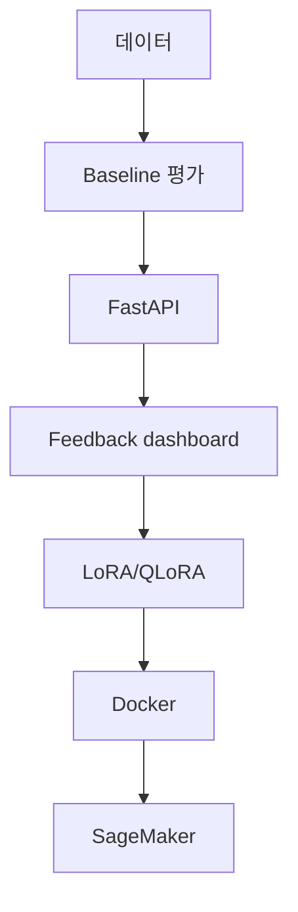

# 한국어 실습 시작 안내

이 저장소는 완성 코드를 구경하는 프로젝트가 아니라, Toyota 보안 ML/AI 직무에 필요한 네 가지 경험을 직접 만드는 실습입니다.

1. LoRA/QLoRA로 보안 경보용 LLM fine-tuning
2. FastAPI와 Docker를 이용한 production-style deployment
3. Streamlit과 SQLite를 이용한 analyst feedback loop
4. SageMaker training job과 endpoint lifecycle

## 전체 학습 흐름

## 권장 환경

- Windows 11: PowerShell 또는 Git Bash
- Python 3.10~3.12
- Git
- Docker Desktop: 6단계부터 필요
- NVIDIA GPU 또는 Google Colab: 5단계 QLoRA에 권장
- AWS 계정: 7단계에만 필요

## 실습 순서

- [0단계: 환경 준비](01_SETUP.md)
- [1단계: 데이터 이해](02_DATA.md)
- [2단계: Baseline 학습과 평가](03_BASELINE.md)
- [3단계: FastAPI 배포](04_API.md)
- [4단계: Feedback dashboard](05_DASHBOARD.md)
- [5단계: LoRA/QLoRA](06_LORA_QLORA.md)
- [6단계: Docker](07_DOCKER.md)
- [7단계: SageMaker](08_SAGEMAKER.md)

각 문서의 `완료 기준`을 통과한 뒤 다음 단계로 가세요. AWS 키, Hugging Face token, 실제 회사 로그는 절대로 GitHub에 올리지 마세요.

## 교수님이 설명할 수 있어야 하는 핵심

- LoRA와 QLoRA의 차이는 무엇인가?
- accuracy만으로 보안 모델을 평가하면 왜 위험한가?
- API health check, typed schema, logging과 test가 왜 필요한가?
- 사람의 수정 결과가 다음 학습 데이터로 어떻게 연결되는가?
- SageMaker endpoint를 왜 반드시 삭제해야 하는가?

